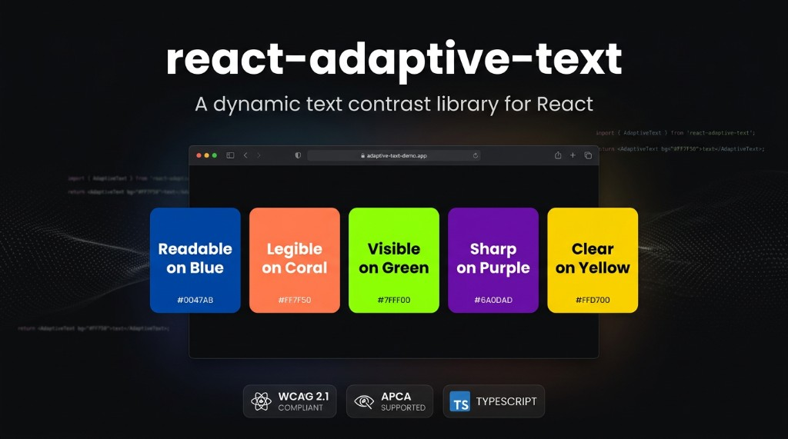

# react-adaptive-text

**npm package:** `@iuzairaslam/react-adaptive-text`

[](https://www.npmjs.com/package/@iuzairaslam/react-adaptive-text)
[](https://github.com/iuzairaslam/react-adaptive-text/actions/workflows/ci.yml)



You pick a background color; this library picks a **foreground** color so the copy stays readable—without manually choosing white vs black on every surface. It uses WCAG-minded contrast math, with optional APCA when you want a more perceptual read.

- **`AdaptiveText`** — text-style element that sets `color` from the background (and optional brand palette).
- **`AdaptiveTextTheme`** — define background and algorithm once for a subtree.
- **`useAdaptiveForegroundColor`** — the same resolution for icons, strokes, or custom markup.
- **Helpers** — luminance, contrast ratio, APCA, palette selection (tests, tooling, or your own components).

TypeScript, no native binaries—React plus browser-friendly color parsing.

## Install

```bash
npm install @iuzairaslam/react-adaptive-text
```

## Basic usage

```tsx
import { AdaptiveText } from '@iuzairaslam/react-adaptive-text';

export function Banner() {
  return (
    <div style={{ background: '#1a237e', padding: 12 }}>
      <AdaptiveText backgroundColor="#1a237e" style={{ fontSize: 18 }}>
        Hello
      </AdaptiveText>
    </div>
  );
}
```

### Theme

```tsx
import { AdaptiveTextTheme, AdaptiveText } from '@iuzairaslam/react-adaptive-text';

export function Card() {
  return (
    <AdaptiveTextTheme backgroundColor="#333" algorithm="wcag">
      <AdaptiveText as="h3" style={{ margin: 0, fontWeight: 700 }}>
        Title
      </AdaptiveText>
      <AdaptiveText as="p" style={{ margin: 0 }}>
        Subtitle
      </AdaptiveText>
    </AdaptiveTextTheme>
  );
}
```

### Palette

```tsx
import { AdaptiveText, ContrastAlgorithm } from '@iuzairaslam/react-adaptive-text';

const brand = ['#ff9800', '#eeeeee', '#ffeb3b'];

export function BrandLine() {
  return (
    <AdaptiveText
      backgroundColor="#000000"
      palette={brand}
      algorithm={ContrastAlgorithm.apca}
    >
      Brand text
    </AdaptiveText>
  );
}
```

## Notes

- Pass colors as CSS strings: hex and `rgb()` / `rgba()` work everywhere; in the browser, named colors usually work too.
- By default **`AdaptiveText`** renders a **`span`**. Use `as="p"`, `as="h1"`, etc. when you need semantic headings or paragraphs.
- If you set **`style.color`** yourself, that always wins—useful when you intentionally override the automatic choice.

## Repository

Issues and source: [github.com/iuzairaslam/react-adaptive-text](https://github.com/iuzairaslam/react-adaptive-text).

## Development

```bash
npm install
npm test
npm run build
```

Try the included Vite example (interactive demos):

```bash
npm run dev:example
```
